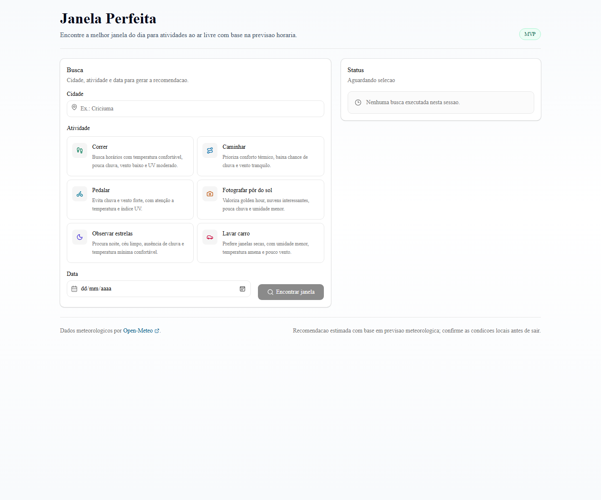
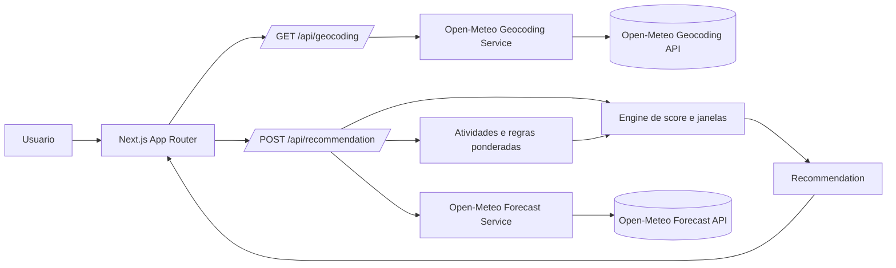

# Janela Perfeita

Janela Perfeita e um web app que transforma previsao meteorologica horaria em
recomendacoes praticas de melhores horarios para atividades ao ar livre.

O produto nao tenta ser mais um app de clima. A previsao e apenas a entrada: a
aplicacao combina regras de dominio, pesos por atividade, contexto solar e
agrupamento de horas consecutivas para responder uma pergunta mais util: "quando
vale a pena fazer esta atividade hoje?".

## Demo

- Local: `http://localhost:3000`, apos `npm run dev`.
- Producao: https://janela-perfeita.vercel.app



## O que o MVP faz

- Busca cidade por nome, sem exigir GPS.
- Recomenda datas de hoje ate hoje+6.
- Suporta seis atividades:
  - correr
  - caminhar
  - pedalar
  - fotografar por do sol
  - observar estrelas
  - lavar carro
- Calcula score de 0 a 100 por hora.
- Mostra melhor janela do dia, alternativas e timeline.
- Explica os principais motivos da recomendacao.
- Informa quando nao ha janela boa.
- Permite compartilhar resultados e repetir buscas recentes salvas no navegador.
- Usa Open-Meteo com atribuicao e disclaimer.
- Nao armazena localizacao, IP, historico ou dados pessoais em servidor.

## Arquitetura



## Como a recomendacao funciona

1. A UI envia cidade, atividade e data para a API interna.
2. A API consulta forecast e astronomia diaria na Open-Meteo.
3. A engine monta contexto por hora:
   - hora local
   - se a data e hoje
   - se a hora ja passou
   - noite
   - golden hour com base no sunset real
   - minutos em relacao ao por do sol
4. Cada atividade avalia fatores com pesos proprios.
5. A engine calcula scores horarios e agrupa horas consecutivas acima do minimo.
6. As janelas sao ordenadas por media, pico, duracao e horario inicial.

## Regras das atividades

| Atividade | Pesos principais | Score minimo | Duracao minima |
| --- | --- | ---: | ---: |
| Correr | temperatura 40, chuva 30, vento 20, UV 10 | 60 | 1h |
| Caminhar | temperatura 40, chuva 35, vento 25 | 60 | 1h |
| Pedalar | chuva 35, temperatura 30, vento 25, UV 10 | 65 | 1h |
| Fotografar por do sol | golden hour 40, nuvens 30, chuva 20, umidade 10 | 60 | 1h |
| Observar estrelas | ceu limpo 50, noite 20, chuva 20, temperatura minima 10 | 70 | 2h |
| Lavar carro | chuva 50, umidade 20, temperatura 20, vento 10 | 65 | 2h |

Todas as atividades mantem pesos somando 100. Scores e fatores sao limitados de
0 a 100.

## Stack

- Next.js 15 com App Router
- React 19
- TypeScript strict
- Tailwind CSS
- shadcn/ui
- TanStack Query
- Zod
- date-fns
- Recharts
- Vitest

## Estrutura principal

```text
src/app/api/geocoding/route.ts          # autocomplete de cidades
src/app/api/recommendation/route.ts     # orquestracao da recomendacao
src/lib/domain/activities.ts            # catalogo das atividades
src/lib/domain/activity-rules.ts        # regras ponderadas
src/lib/engine/weather-context.ts       # contexto solar e horario
src/lib/engine/score-calculator.ts      # score por hora
src/lib/engine/window-finder.ts         # melhores janelas
src/lib/services/open-meteo.*           # servicos e schemas externos
src/components/result/*                 # resultado, timeline e breakdown
tests/                                  # cobertura de dominio, engine, API e UI
```

## Como rodar

Pre-requisitos:

- Node.js 20 LTS
- npm
- Git

Instale dependencias:

```bash
npm install
```

Rode em desenvolvimento:

```bash
npm run dev
```

Abra:

```text
http://localhost:3000
```

## Como testar

```bash
npm run lint
npm test
npm run test:coverage
npm run build
```

Cobertura registrada apos a issue #9:

| Metrica | Cobertura |
| --- | ---: |
| Statements | 93.13% |
| Branches | 78.91% |
| Functions | 93.25% |
| Lines | 93.72% |

O relatorio HTML local fica em `coverage/index.html`.

## PWA

O app inclui `public/manifest.json` e icones em `public/icons/`:

- `icon-192.png`
- `icon-512.png`
- `maskable-icon-512.png`
- `apple-touch-icon.png`

O metadata do App Router referencia o manifest e os icones para compatibilidade
com Next.js 15.

## CI

O GitHub Actions roda em PRs e pushes para `develop` e `main`.

Workflow: `.github/workflows/ci.yml`

Etapas:

```text
npm ci
npm run lint
npm test
npm run test:coverage
npm run build
```

## Deploy

Configuracao recomendada na Vercel:

- Framework: Next.js
- Install command: `npm ci`
- Build command: `npm run build`
- Output: padrao do Next.js
- Variaveis de ambiente: nenhuma obrigatoria no MVP

Deploy atual:

```text
https://janela-perfeita.vercel.app
```

O MVP nao precisa de banco, backend externo separado, login, autenticacao,
pagamento, anuncios ou marketplace.

## Open-Meteo

Este projeto usa dados da Open-Meteo:

- Forecast API: https://open-meteo.com/en/docs
- Geocoding API: https://open-meteo.com/en/docs/geocoding-api
- Terms: https://open-meteo.com/en/terms
- Licence: https://open-meteo.com/en/licence

Uso tratado como nao comercial e de portfolio. As recomendacoes sao estimativas
baseadas em previsao meteorologica e nao substituem avaliacao local das
condicoes.

## Privacidade

No MVP, Janela Perfeita:

- nao exige login
- nao usa banco de dados
- salva apenas as ultimas 5 buscas no `localStorage` do proprio navegador
- permite limpar esse historico local pela interface
- nao envia historico local para servidor
- nao armazena localizacao em servidor
- nao armazena IP ou dados pessoais

## Fluxo de desenvolvimento

- `main`: branch final e estavel.
- `develop`: branch de integracao.
- Features e tarefas saem de `develop` e voltam por PR.
- Commits seguem Conventional Commits com descricao em portugues.
- Branches de feature sao preservadas apos merge.
