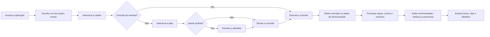
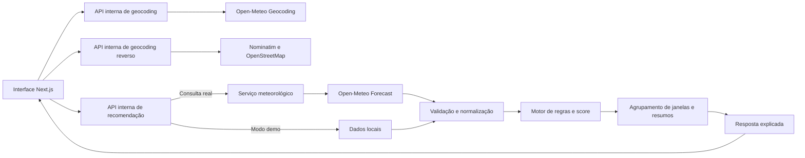

# Janela Perfeita

## Clima por decisão

Um *Weather Decision Cockpit* que transforma previsão horária em decisões
práticas para atividades sensíveis ao clima.

[](https://github.com/PauloSergioLR/janela-perfeita/actions/workflows/ci.yml)


[](LICENSE)

[Aplicação online](https://janela-perfeita.vercel.app) ·
[Como funciona](#como-funciona) ·
[Código-fonte](https://github.com/PauloSergioLR/janela-perfeita) ·
[Checklist de lançamento](docs/release-checklist.md)


## Visão geral

Janela Perfeita ajuda a responder uma pergunta mais útil do que “como estará o
tempo?”: **quando vale a pena realizar determinada atividade?** A aplicação
combina previsão horária, regras próprias por atividade, score explicável e
agrupamento de horas consecutivas para destacar as melhores oportunidades.

A primeira tela é a ferramenta. Busca, controles, score, janela recomendada,
confiança e exploração da previsão convivem em um cockpit responsivo, com temas
claro e escuro e hierarquia orientada à decisão.

## O problema

Aplicativos meteorológicos normalmente apresentam temperatura, chuva, vento e
outros indicadores isolados. A pessoa ainda precisa interpretar todos esses
dados e decidir se o período serve para correr, pedalar, observar estrelas ou
realizar outra atividade.

Essa interpretação muda conforme a atividade: chuva futura pesa muito ao lavar
roupa, enquanto nuvens, visibilidade e horário solar importam mais para observar
estrelas ou fotografar o pôr do sol.

## A solução

A pessoa seleciona uma cidade, um modo de consulta e, quando necessário, uma
data, uma atividade e uma faixa de disponibilidade. O Janela Perfeita consulta
a previsão, avalia cada hora, agrupa períodos adequados e apresenta o resultado
com contexto:

- score de 0 a 100;
- melhor janela e outras opções classificadas;
- nível de confiança baseado na estabilidade das condições;
- motivos favoráveis e desfavoráveis;
- timeline horária, estatísticas e comparação de dias;
- ranking de atividades ou panorama diário/semanal, conforme o modo.

## Diferenciais

- **Decisão, não apenas previsão:** dados climáticos viram uma resposta prática.
- **Regras por atividade:** cada uso possui fatores, pesos, duração e score
  mínimo próprios.
- **Score explicável:** motivos e fatores ficam visíveis em vez de produzir uma
  nota opaca.
- **Janelas consecutivas:** o motor procura períodos úteis, não apenas um pico
  horário isolado.
- **Confiança contextual:** indica estabilidade da janela; não promete acurácia
  absoluta.
- **Quatro modos complementares:** recomendação, ranking, consulta diária e
  consulta semanal.
- **Privacidade local:** sem login ou banco de dados; histórico recente fica no
  navegador.
- **Infraestrutura simples:** fonte climática gratuita, sem chave obrigatória.
- **Qualidade automatizada:** lint, testes, cobertura, build e E2E no CI.

## Funcionalidades

### Decisão climática

- score horário e classificação visual;
- melhor janela, alternativas e melhor hora isolada quando não há janela boa;
- confiança alta, média ou baixa;
- motivos da recomendação e detalhamento dos fatores;
- disponibilidade opcional para restringir o período analisado.

### Exploração

- timeline horária completa;
- estatísticas de temperatura, chuva, vento, umidade, UV e luz solar;
- próximos dias e comparação semanal da atividade;
- ranking das sete atividades;
- destaques e extremos da previsão de sete dias.

### Experiência

- busca textual de cidades e localização atual opcional;
- histórico local das cinco consultas recentes, com ação para limpar;
- compartilhamento pelo recurso nativo do dispositivo ou cópia de texto;
- temas claro e escuro, layout responsivo e estados de carregamento, vazio e
  erro;
- modo demo com dados locais;
- manifesto web e ícones instaláveis, sem promessa de funcionamento offline.

## Modos da aplicação

### Janela perfeita

Recebe cidade, data, atividade e disponibilidade opcional. Calcula score por
hora, melhor janela, alternativas, confiança e motivos. O resultado também
permite explorar timeline, próximos dias, comparação semanal, estatísticas e
fatores.

### O que fazer hoje?

Recebe cidade, data e disponibilidade opcional. Avalia as sete atividades no
mesmo período e cria um ranking com score, melhor janela, confiança e motivo de
cada opção.

### Consulta do dia

Recebe cidade e data, sem exigir atividade. Resume as condições do dia e expõe
métricas, períodos de luz solar e timeline horária completa.

### Consulta da semana

Recebe a cidade e analisa os sete dias seguintes na data local dela. Compara os
dias, destaca melhores e piores condições, maior chance de chuva e extremos
meteorológicos, sem exigir atividade.

## Atividades suportadas

| Atividade | Fatores principais confirmados no domínio |
| --- | --- |
| Correr | Sensação térmica, chuva, vento e UV |
| Caminhar | Sensação térmica, chuva e vento |
| Pedalar | Chuva, temperatura, vento, rajadas e UV |
| Fotografar pôr do sol | Hora dourada, nuvens, visibilidade, chuva e luminosidade |
| Observar estrelas | Noite, qualidade do céu e chuva; qualidade considera também visibilidade, umidade e temperatura |
| Lavar carro | Chuva atual e futura, umidade, temperatura e vento |
| Lavar roupa | Chuva atual e futura, umidade, vento para secagem e temperatura |

Cada atividade define também duração mínima e score de corte. Para lavar carro
e lavar roupa, chuva prevista nas horas seguintes reduz a recomendação mesmo
quando a hora atual está seca.

## Jornada da pessoa usuária


```mermaid
flowchart LR
    A[Acessa a aplicação] --> B[Escolhe um dos quatro modos]
    B --> C[Seleciona a cidade]
    C --> D{Consulta da semana?}
    D -- Sim --> I[Executa a consulta]
    D -- Não --> E[Seleciona a data]
    E --> F{Janela perfeita?}
    F -- Sim --> G[Escolhe a atividade]
    F -- Não --> H[Revisa a consulta]
    G --> H
    H --> I
    I --> J[Obtém previsão ou dados de demonstração]
    J --> K[Processa regras, scores e resumos]
    K --> L[Exibe recomendação, ranking ou panorama]
    L --> M[Explora horas, dias e detalhes]
```

Nos modos Janela perfeita e O que fazer hoje?, a pessoa pode ainda limitar a
análise à sua disponibilidade antes de executar a consulta.

<a name="como-funciona"></a>

## Como a recomendação funciona

1. A interface recebe cidade, data, modo, atividade e disponibilidade quando
   aplicáveis.
2. A rota interna valida o contrato com Zod e resolve a cidade, se necessário.
3. O serviço consulta a previsão horária e a astronomia diária da Open-Meteo.
4. A resposta externa é validada e normalizada para o domínio da aplicação.
5. A engine constrói o contexto meteorológico e solar de cada hora.
6. As regras da atividade geram notas por fator; a média ponderada produz um
   score entre 0 e 100.
7. Horas passadas ou fora da disponibilidade recebem score zero; horas abaixo
   do corte não entram no agrupamento de janelas, mas continuam visíveis na
   timeline.
8. Horas consecutivas suficientes são agrupadas em janelas e ordenadas por
   média, pico, duração e início.
9. O sistema gera melhor janela, alternativas, motivos, avisos e confiança.
10. A interface apresenta o resultado e suas formas de exploração.

A confiança é uma heurística de estabilidade. Ela considera sinais como chuva,
rajadas, variação de nuvens e oscilação dos scores dentro da janela; não é uma
probabilidade de acerto fornecida pelo serviço meteorológico.

> **Aviso:** o resultado é estimado e previsões podem mudar. O Janela Perfeita
> apoia decisões, mas não substitui alertas meteorológicos oficiais, avaliação
> das condições no local ou cuidados de segurança da atividade.

## Arquitetura e fluxo de dados


```mermaid
flowchart LR
    UI[Interface Next.js] --> GEO[API interna de geocoding]
    UI --> REV[API interna de geocoding reverso]
    UI --> REC[API interna de recomendação]
    GEO --> OM_GEO[Open-Meteo Geocoding]
    REV --> NOM[Nominatim e OpenStreetMap]
    REC -->|Consulta real| WEATHER[Serviço meteorológico]
    REC -->|Modo demo| DEMO[Dados locais]
    WEATHER --> OM_FORECAST[Open-Meteo Forecast]
    OM_FORECAST --> NORMALIZE[Validação e normalização]
    DEMO --> NORMALIZE
    NORMALIZE --> ENGINE[Motor de regras e score]
    ENGINE --> WINDOWS[Agrupamento de janelas e resumos]
    WINDOWS --> RESPONSE[Resposta explicada]
    RESPONSE --> UI
```

A Open-Meteo é a única fonte climática. O Nominatim participa somente do fluxo
opcional de geocodificação reversa, para transformar coordenadas autorizadas
pelo navegador em uma cidade aproximada.

### Camadas

| Camada | Responsabilidade |
| --- | --- |
| Interface | Modos, formulários, estados e visualizações do cockpit |
| Rotas internas | Validação de entrada e coordenação das consultas |
| Serviços | Open-Meteo para cidades e previsão; Nominatim para geocodificação reversa |
| Domínio | Atividades, fatores, pesos, duração e limites |
| Engine | Contexto climático, score, confiança, janelas, ranking e resumos |
| Apresentação | Contratos e transformações consumidos pelos componentes |
| Testes | Regras, integrações, UI crítica e fluxos E2E com dados controlados |

## Stack técnica

| Área | Tecnologia confirmada |
| --- | --- |
| Framework | Next.js 15.5 com App Router e Turbopack |
| Interface | React 19, Base UI e componentes shadcn/ui |
| Linguagem | TypeScript 5 em modo strict |
| Estilos | Tailwind CSS 4 |
| Dados assíncronos | TanStack Query 5 |
| Validação | Zod 4 |
| Datas | date-fns 4 |
| Visualização | Recharts 3 |
| Ícones | Lucide React |
| Testes | Vitest 4, cobertura V8 e Playwright 1.60 |
| Dados climáticos | Open-Meteo |
| Geocodificação reversa | Nominatim e dados OpenStreetMap |
| Deploy | Vercel |

## Estrutura do projeto

```text
src/
├── app/                 # páginas, layout e rotas internas
├── components/          # controles e visualizações
└── lib/
    ├── domain/          # atividades e regras
    ├── engine/          # score, confiança, janelas e resumos
    ├── services/        # integrações Open-Meteo e Nominatim
    ├── weather/         # contrato do provedor meteorológico
    ├── ui/              # contratos de apresentação
    ├── demo/            # dados locais do modo demo
    └── backtesting/     # simulação técnica local

tests/                   # testes unitários e de integração
e2e/                     # fluxos Playwright
docs/                    # documentação e imagem principal
public/                  # manifesto e ícones instaláveis
```

## Qualidade e testes

- TypeScript strict e ESLint;
- testes unitários e de integração com Vitest;
- cobertura V8 publicada no terminal e em relatórios locais, sem percentual
  estático no README;
- E2E em Chromium com Playwright e dados controlados, sem depender de clima
  externo;
- testes focados em domínio, engine, serviços, contratos, estados e UI crítica;
- fluxo de CI em pushes e PRs para `develop` e `main`;
- temas claro/escuro, responsividade e estados de carregamento, erro e vazio;
- manifesto web e ícones para experiência instalável.

O workflow de CI executa `npm ci`, instala Chromium e roda lint, testes,
cobertura, build e E2E. O badge no início aponta para o workflow real.

### Scripts

| Comando | Finalidade |
| --- | --- |
| `npm run dev` | Inicia o ambiente local com Turbopack |
| `npm run lint` | Executa ESLint |
| `npm test` | Executa a suíte Vitest uma vez |
| `npm run test:coverage` | Gera cobertura V8 |
| `npm run test:e2e` | Executa os fluxos Playwright em Chromium |
| `npm run build` | Gera o build de produção |
| `npm start` | Serve o build de produção |

## Execução local

### Pré-requisitos

- Node.js 20;
- npm;
- Git.

### Instalação

```bash
git clone https://github.com/PauloSergioLR/janela-perfeita.git
cd janela-perfeita
npm install
npm run dev
```

Abra `http://localhost:3000`.

O fluxo atual não exige chave de API ou variável de ambiente obrigatória.
`process.env.CI` é usado apenas para adaptar o Playwright no CI.

### Playwright

Em uma instalação nova:

```bash
npx playwright install chromium
npm run test:e2e
```

## Modo demo e páginas técnicas

- `/?demo=true`: usa dados locais representativos de Criciúma na busca e na
  previsão. A localização automática fica desativada. Serve para conhecer os
  fluxos; não representa previsão real. Se a localização atual for acionada
  manualmente, a geocodificação reversa ainda pode consultar o Nominatim.
- `/como-funciona`: explica modos, metodologia do score, confiança, dados,
  privacidade e limitações para a pessoa usuária.
- `/tecnico/backtesting`: apresenta uma simulação inicial sobre fixture local de
  30 dias. Valida o encadeamento técnico, não comprova acurácia meteorológica e
  não constitui estudo científico.

## Dados, privacidade e limitações

- A Open-Meteo fornece busca textual de cidades, previsão horária e dados
  solares sem chave obrigatória no fluxo atual.
- Ao autorizar a localização atual, o navegador fornece coordenadas à rota
  interna; o Nominatim usa essas coordenadas para obter um nome aproximado de
  cidade.
- Até cinco consultas recentes podem permanecer no `localStorage`, incluindo
  cidade, coordenadas associadas, modo, atividade, data e disponibilidade. A
  interface permite apagar esse histórico.
- A preferência de tema também fica no navegador.
- Não há login, banco de dados ou histórico pessoal persistido no servidor.
- Compartilhamento envia ou copia apenas o resumo textual escolhido pela pessoa.
- Previsões e geocodificação dependem de serviços externos e podem ficar
  indisponíveis, mudar ou divergir das condições observadas.
- O manifesto não implica suporte offline; consultas reais precisam de rede.

Consulte também a [política de privacidade da Open-Meteo](https://open-meteo.com/en/terms)
e a [política do Nominatim](https://operations.osmfoundation.org/policies/nominatim/)
para entender o tratamento feito pelos serviços externos.

## Deploy e preparação para lançamento

O projeto é compatível com a configuração convencional de um app Next.js na
Vercel. Como não existe `vercel.json`, comandos sobrescritos no painel precisam
ser conferidos antes da release:

| Item | Estado no repositório |
| --- | --- |
| Framework | Next.js, detectável pela Vercel |
| Instalação | `npm ci` recomendado para a release; confirmar no painel |
| Build | Script `npm run build` disponível; confirmar no painel |
| Node.js | 20 recomendado |
| Variáveis obrigatórias | Nenhuma |

Não há configuração especial em `next.config.ts`. Branch de produção, domínio
e smoke tests devem ser conferidos no processo de release; esta documentação
não executa deploy.

## Versão atual

A versão pública atual do Janela Perfeita é a **1.0.0**.

A branch `develop` concentra o desenvolvimento contínuo e a branch `main`
representa a versão de produção publicada na Vercel.

O processo operacional de release está documentado em
[docs/release-checklist.md](docs/release-checklist.md).

## Autor, créditos e licença

Desenvolvido por **Paulo Sergio**. Repositório mantido no GitHub por
[@PauloSergioLR](https://github.com/PauloSergioLR).

Dados e serviços:

- [Open-Meteo](https://open-meteo.com/) — geocodificação textual e previsão;
- [OpenStreetMap](https://www.openstreetmap.org/copyright) e
  [Nominatim](https://nominatim.org/) — geocodificação reversa opcional.

Distribuído sob a [licença MIT](LICENSE).
