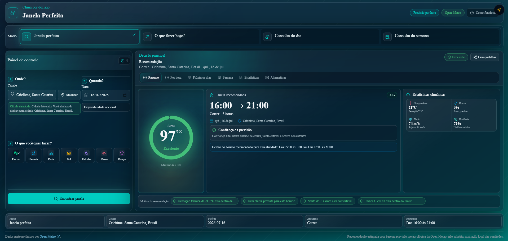

# Janela Perfeita

Janela Perfeita e um web app que transforma previsao meteorologica horaria em
recomendacoes praticas de melhores janelas para atividades ao ar livre.

O produto nao tenta ser apenas mais um app de clima. A previsao e a entrada; a
entrega e uma decisao: a aplicacao combina regras de dominio, pesos por
atividade, contexto solar, confianca da previsao e agrupamento de horas
consecutivas para responder uma pergunta mais util: "quando vale a pena fazer
esta atividade?".

## Demo

- Local: `http://localhost:3000`, apos `npm run dev`.
- Producao: https://janela-perfeita.vercel.app



## O que o app faz hoje

- Busca cidade por nome, sem exigir GPS.
- Recomenda datas de hoje ate hoje+6.
- Permite consultar o clima completo de um dia sem escolher atividade.
- Suporta sete atividades:
  - correr
  - caminhar
  - pedalar
  - fotografar por do sol
  - observar estrelas
  - lavar carro
  - lavar roupa
- Calcula score de 0 a 100 por hora.
- Mostra melhor janela do dia, alternativas e timeline.
- Explica os principais motivos da recomendacao.
- Informa quando nao ha janela boa.
- Calcula confianca da previsao dentro da janela recomendada.
- Considera probabilidade de chuva, chuva, pancadas, weather code, sensacao
  termica, rajadas, visibilidade, duracao de sol e camadas de nuvens.
- Oferece modo inverso para responder "o que fazer hoje?".
- Compara melhores dias da semana para uma atividade.
- Compara modelos da Open-Meteo quando solicitado.
- Pode consultar MET Norway como segunda fonte gratuita quando
  `MET_NORWAY_USER_AGENT` existe.
- Permite compartilhar resultados e repetir buscas recentes salvas no navegador.
- Inclui uma pagina tecnica de backtesting com fixture historica local.
- Inclui `/como-funciona` para explicar score, pesos, janelas e limitações.
- Permite modo demo isolado via `?demo=true`.
- Usa Open-Meteo com atribuicao e disclaimer.
- Nao armazena localizacao, IP, historico ou dados pessoais em servidor.

## Arquitetura

```mermaid
flowchart LR
  U[Usuario] --> UI[Next.js App Router]
  UI --> GEO[/GET /api/geocoding/]
  UI --> REC[/POST /api/recommendation/]
  UI --> DEMO[?demo=true]
  UI --> TECH[/como-funciona e /tecnico/backtesting/]

  GEO --> GS[Open-Meteo Geocoding Service]
  GS --> OMGeo[(Open-Meteo Geocoding API)]

  REC --> WP[WeatherProvider]
  REC --> ACT[Atividades e regras ponderadas]
  REC --> ENG[Engine de score e janelas]
  REC --> CMP[Comparacao de modelos/providers]
  DEMO --> FIX[Fixtures locais]

  WP --> OMForecast[(Open-Meteo Forecast API)]
  WP -. estrategia v1.1 .-> MET[(MET Norway Locationforecast)]
  WP -. alternativa futura .-> WAPI[(WeatherAPI.com)]
  ACT --> ENG
  ENG --> OUT[Recommendation / Ranking / Semana]
  CMP --> OUT
  FIX --> ENG
  OUT --> UI
```

## Como a recomendacao funciona

1. A UI envia cidade, modo, atividade quando necessaria e data para a API interna.
2. A API consulta forecast e astronomia diaria via `WeatherProvider`.
3. A engine monta contexto por hora:
   - hora local
   - se a data e hoje
   - se a hora ja passou
   - noite
   - golden hour com base no sunset real
   - minutos em relacao ao por do sol
4. Cada atividade avalia fatores com pesos proprios.
5. A engine calcula scores horarios e agrupa horas consecutivas acima do minimo.
6. As janelas sao ordenadas por media, pico, duracao e horario inicial.
7. A melhor janela recebe confianca baseada na estabilidade dos fatores.
8. Em modos extras, a mesma engine gera ranking de atividades ou comparacao da
   semana; o modo "Consulta do dia" consolida os dados horarios em um overview
   diario sem depender de atividade.

## Dados meteorologicos usados

O score usa dados horarios normalizados:

- temperatura e sensacao termica;
- precipitacao, chuva, pancadas, probabilidade de chuva e weather code;
- vento medio e rajadas;
- cobertura de nuvens total, baixa, media e alta;
- visibilidade;
- duracao de sol;
- indice UV;
- umidade relativa;
- nascer e por do sol diarios.

## Regras das atividades

| Atividade | Pesos principais | Score minimo | Duracao minima |
| --- | --- | ---: | ---: |
| Correr | temperatura 40, chuva 30, vento 20, UV 10 | 60 | 1h |
| Caminhar | temperatura 40, chuva 35, vento 25 | 60 | 1h |
| Pedalar | chuva 35, temperatura 25, vento 15, rajadas 15, UV 10 | 65 | 1h |
| Fotografar por do sol | hora dourada 35, nuvens 25, visibilidade 20, chuva 15, sol 5 | 60 | 1h |
| Observar estrelas | noite 45, qualidade do ceu 45, chuva 10 | 70 | 2h |
| Lavar carro | chuva 50, umidade 20, temperatura 20, vento 10 | 65 | 2h |
| Lavar roupa | chuva 35, umidade 25, vento para secagem 25, temperatura 15 | 65 | 3h |

Todas as atividades mantem pesos somando 100. Scores e fatores sao limitados de
0 a 100.

## Funcionalidades tecnicas

- **Confianca da previsao:** mostra se a janela e estavel ou se ha variacao
  relevante de chuva, vento, temperatura e nuvens.
- **Consulta do dia:** mostra resumo diario com temperatura, sensacao termica,
  chuva, vento, rajadas, UV, nascer/por do sol, weather code e timeline horaria.
- **Modo inverso:** ranqueia as sete atividades para a mesma cidade e data.
- **Comparacao semanal:** compara os proximos dias para encontrar o melhor dia
  de uma atividade.
- **Comparacao de modelos:** opcionalmente consulta modelos Open-Meteo extras e
  mostra divergencia, sem fazer media cega.
- **Provider MET Norway:** segunda fonte gratuita opcional da v1.1 para
  comparacao e alerta de divergencia quando `MET_NORWAY_USER_AGENT` existe,
  com score, nivel de concordancia e motivos de divergencia.
  WeatherAPI.com fica apenas como alternativa opcional futura.
- **Historico local:** salva somente as ultimas buscas no `localStorage`.
- **Compartilhamento:** gera texto compartilhavel do resultado.
- **Modo demo:** usa fixture local apenas com `?demo=true`.
- **Backtesting:** pagina tecnica valida a metodologia com amostra local.

## Stack

- Next.js 15 com App Router
- React 19
- TypeScript strict
- Tailwind CSS
- shadcn/ui
- TanStack Query
- Zod
- date-fns
- Recharts
- Vitest
- Playwright

## Estrutura principal

```text
src/app/api/geocoding/route.ts          # autocomplete de cidades
src/app/api/recommendation/route.ts     # orquestracao da recomendacao
src/lib/demo/*                          # fixtures isoladas do modo demo
src/lib/domain/activities.ts            # catalogo das atividades
src/lib/domain/activity-rules.ts        # regras ponderadas
src/lib/engine/weather-context.ts       # contexto solar e horario
src/lib/engine/score-calculator.ts      # score por hora
src/lib/engine/window-finder.ts         # melhores janelas
src/lib/backtesting/*                   # backtesting tecnico isolado
src/lib/ui/score-explainer.ts           # dados da pagina como funciona
src/lib/services/open-meteo.*           # servicos e schemas externos
src/lib/services/met-norway-weather.*   # segunda fonte gratuita opcional
src/lib/services/weatherapi-weather.*   # fonte opcional existente, sem chave obrigatoria
src/lib/weather/*                       # providers e comparacoes de previsao
src/components/result/*                 # resultado, timeline e breakdown
tests/                                  # cobertura de dominio, engine, API e UI
e2e/                                    # testes E2E com Playwright
```

## Como rodar

Pre-requisitos:

- Node.js 20 LTS
- npm
- Git

Instale dependencias:

```bash
npm install
```

Rode em desenvolvimento:

```bash
npm run dev
```

Abra:

```text
http://localhost:3000
```

## Como testar

```bash
npm run lint
npm test
npm run test:coverage
npm run build
npm run test:e2e
```

Cobertura local atual:

| Metrica | Cobertura |
| --- | ---: |
| Statements | 94.94% |
| Branches | 80.80% |
| Functions | 96.33% |
| Lines | 95.14% |

O relatorio HTML local fica em `coverage/index.html`.

Os testes E2E usam Playwright e exercitam o fluxo real da aplicacao, incluindo
as rotas internas de geocoding e recomendacao. Na primeira execucao local,
instale o navegador:

```bash
npx playwright install chromium
```

Depois rode:

```bash
npm run test:e2e
```

## Modo demo

Para apresentar o projeto sem depender de API externa, abra:

```text
http://localhost:3000?demo=true
```

Nesse modo, cidade e previsao usam dados locais representativos. O fluxo normal
sem `demo=true` continua usando as APIs reais. Buscas feitas em modo demo nao
sao salvas no historico local para evitar mistura com uso normal.

## Backtesting tecnico

A pagina interna `/tecnico/backtesting` gera um relatorio local de backtesting
para uma amostra preparada de Criciuma. Ela reaproveita a engine atual para
responder, de forma inicial:

```text
Se o app tivesse recomendado essa janela, ela teria sido boa de verdade?
```

Metricas exibidas:

- janelas recomendadas;
- porcentagem de janelas que permaneceram secas;
- score medio previsto e observado;
- erro medio de temperatura;
- principais fatores de divergencia;
- taxa estimada de acerto.

Limites importantes: a amostra atual e uma fixture local, nao uma auditoria
meteorologica oficial. O objetivo e validar a metodologia sem afetar o fluxo
principal, sem banco de dados e sem chamadas externas adicionais.

## PWA

O app inclui `public/manifest.json` e icones em `public/icons/`:

- `icon-192.png`
- `icon-512.png`
- `maskable-icon-512.png`
- `apple-touch-icon.png`

O metadata do App Router referencia o manifest e os icones para compatibilidade
com Next.js 15.

## CI

O GitHub Actions roda em PRs e pushes para `develop` e `main`.

Workflow: `.github/workflows/ci.yml`

Etapas:

```text
npm ci
npx playwright install --with-deps chromium
npm run lint
npm test
npm run test:coverage
npm run build
npm run test:e2e
```

## Deploy

Configuracao recomendada na Vercel:

- Framework: Next.js
- Install command: `npm ci`
- Build command: `npm run build`
- Output: padrao do Next.js
- Variaveis de ambiente obrigatorias: nenhuma
- Variaveis opcionais: `MET_NORWAY_USER_AGENT`

Deploy atual:

```text
https://janela-perfeita.vercel.app
```

O MVP nao precisa de banco, backend externo separado, login, autenticacao,
pagamento, anuncios ou marketplace.

## Paginas tecnicas

- `/como-funciona`: explica score, pesos, janelas, confianca e limitacoes.
- `/tecnico/backtesting`: mostra um relatorio tecnico com fixture historica
  local.

Essas paginas ajudam a defender o projeto em entrevista, GitHub e portfolio sem
misturar texto longo na experiencia principal.

## Open-Meteo

Este projeto usa dados da Open-Meteo:

- Forecast API: https://open-meteo.com/en/docs
- Geocoding API: https://open-meteo.com/en/docs/geocoding-api
- Terms: https://open-meteo.com/en/terms
- Licence: https://open-meteo.com/en/licence

Uso tratado como nao comercial e de portfolio. As recomendacoes sao estimativas
baseadas em previsao meteorologica e nao substituem avaliacao local das
condicoes.

O projeto usa atribuicao visivel para Open-Meteo na interface e no README.

## Estrategia de segunda fonte meteorologica

Open-Meteo segue como provider principal da aplicacao.

Para a versao 1.1, a segunda fonte preferencial e a MET Norway Locationforecast
API, porque e gratuita, tem cobertura global, nao exige API key e exige apenas
um `User-Agent` identificando a aplicacao.

```bash
MET_NORWAY_USER_AGENT="JanelaPerfeita/1.1 contato@example.com"
```

Use essa variavel em `.env.local` no desenvolvimento ou nas variaveis da Vercel.
Nao usar User-Agent generico. Sem essa variavel, o app continua funcionando
normalmente apenas com Open-Meteo.

A segunda fonte nao deve substituir automaticamente a Open-Meteo e nao deve
fazer media cega entre APIs. Ela serve para:

- comparar previsoes;
- medir divergencia entre fontes;
- reduzir falsa confianca;
- exibir aviso quando as fontes discordarem.

WeatherAPI.com fica apenas como alternativa opcional futura. Ela nao e provider
padrao da v1.1, nao deve ser obrigatoria e nao pode tornar o funcionamento do
app dependente de API paga ou chave obrigatoria.

Observacao tecnica: a MET Norway Locationforecast nao entrega todos os mesmos
campos da Open-Meteo, como astronomia, visibilidade, UV observado e duracao de
sol. Por isso, o provider MET Norway e usado como fonte secundaria de
comparacao; a recomendacao principal continua baseada na Open-Meteo.

Referencias oficiais:

- MET Norway: https://api.met.no/weatherapi/locationforecast/2.0/documentation
- Getting Started MET Norway: https://api.met.no/doc/GettingStarted
- WeatherAPI.com: https://www.weatherapi.com/docs/

## Privacidade

Janela Perfeita:

- nao exige login
- nao usa banco de dados
- salva apenas as ultimas 5 buscas no `localStorage` do proprio navegador
- permite limpar esse historico local pela interface
- nao envia historico local para servidor
- nao armazena localizacao em servidor
- nao armazena IP ou dados pessoais

## Limitacoes

- Previsao meteorologica pode mudar; o app nao promete precisao absoluta.
- O score e uma estimativa baseada nas regras atuais, nao uma garantia de
  seguranca ou conforto.
- MET Norway e a segunda fonte gratuita opcional da v1.1.
- WeatherAPI.com fica apenas como alternativa opcional futura.
- Comparacoes entre modelos e providers mostram divergencia; nao fazem media
  automatica entre fontes.
- O backtesting atual usa amostra local preparada, nao auditoria meteorologica
  oficial.
- O modo demo existe apenas para apresentacao controlada.

## Roadmap

- Melhorar a amostra do backtesting com dados historicos reais e reprodutiveis.
- Criar mais cenarios E2E para modos semana, inverso, demo e compartilhamento.
- Evoluir acessibilidade e tema visual sem mudar a regra de negocio.
- Comparar Open-Meteo e MET Norway com avisos mais detalhados de divergencia.
- Manter novas fontes meteorologicas somente como comparacao explicita.

## Fluxo de desenvolvimento

- `main`: branch final e estavel.
- `develop`: branch de integracao.
- Features e tarefas saem de `develop` e voltam por PR.
- Commits seguem Conventional Commits com descricao em portugues.
- Branches de feature sao preservadas apos merge.
